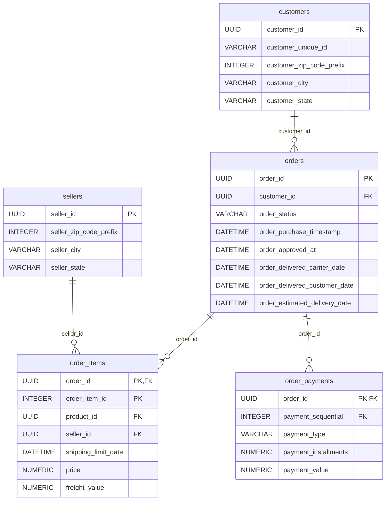

# Modelo entidad-relación (ER) normalizado

```mermaid
erDiagram
    customers ||--o{ orders : customer_id
    orders ||--o{ order_items : order_id
    orders ||--o{ order_payments : order_id
    sellers ||--o{ order_items : seller_id

    customers {
        UUID customer_id PK
        VARCHAR customer_unique_id
        INTEGER customer_zip_code_prefix
        VARCHAR customer_city
        VARCHAR customer_state
    }
    orders {
        UUID order_id PK
        UUID customer_id FK
        VARCHAR order_status
        DATETIME order_purchase_timestamp
        DATETIME order_approved_at
        DATETIME order_delivered_carrier_date
        DATETIME order_delivered_customer_date
        DATETIME order_estimated_delivery_date
    }
    order_items {
        UUID order_id PK,FK
        INTEGER order_item_id PK
        UUID product_id FK
        UUID seller_id FK
        DATETIME shipping_limit_date
        NUMERIC price
        NUMERIC freight_value
    }
    order_payments {
        UUID order_id PK,FK
        INTEGER payment_sequential PK
        VARCHAR payment_type
        NUMERIC payment_installments
        NUMERIC payment_value
    }
    sellers {
        UUID seller_id PK
        INTEGER seller_zip_code_prefix
        VARCHAR seller_city
        VARCHAR seller_state
    }
```
